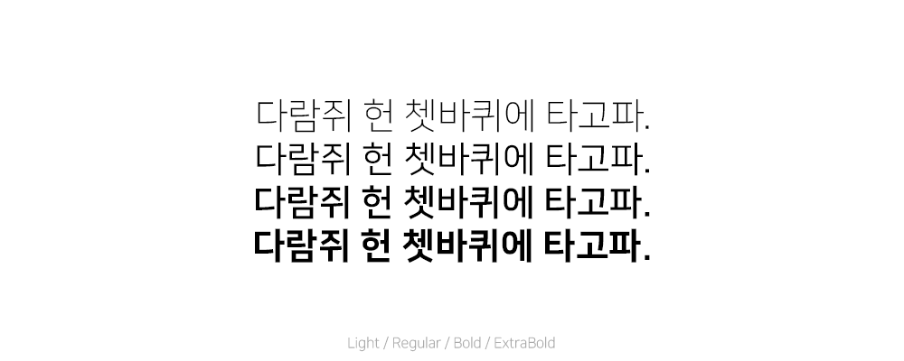

# 🔠 개인/상업용 무료 폰트 모음집
`HTML5-<link>` 태그 또는 `CSS-@import`로 불러올 수 있는 Font를 모았습니다.<br>
Pull Request시 아래 예시 이미지 속성과 동일하게 이미지를 첨부해야합니다.

### 예시 이미지 속성
> 이미지 크기 : 1000px * 400px<br>
> 폰트 크기 : 40px<br>
> 배경 둥근 모서리 : 40px

---

## 나눔스퀘어
> 네이버 한글한글 아름답게 캠페인
> https://hangeul.naver.com/font/nanum

### Light / Regular / Bold / ExtraBold



1. `link`로 불러온 후
```html
<link href="https://hangeul.pstatic.net/hangeul_static/css/nanum-square.css" rel="stylesheet">
```
2. CSS에서 원하는 Font-Family 사용
```css
font-family: 'NanumSquareLight';
font-family: 'NanumSquare';
font-family: 'NanumSquareBold';
font-family: 'NanumSquareExtraBold';
font-family: 'NanumSquareAcb';
font-family: 'NanumSquareAceb';
font-family: 'NanumSquareAcl';
font-family: 'NanumSquareAcr';
```

---

## 나눔스퀘어 네오
> 네이버 한글한글 아름답게 캠페인
> https://hangeul.naver.com/font/nanum

### Light / Regular / Bold / ExtraBold / Heavy


1. `link`로 불러온 후
```html
<link href="https://hangeul.pstatic.net/hangeul_static/css/nanum-square-neo.css" rel="stylesheet">
```
2. CSS에서 원하는 Font-Family 사용
```css
font-family: 'NanumSquareNeoLight';
font-family: 'NanumSquareNeo';
font-family: 'NanumSquareNeoBold';
font-family: 'NanumSquareNeoExtraBold';
font-family: 'NanumSquareNeoHeavy';
```

---